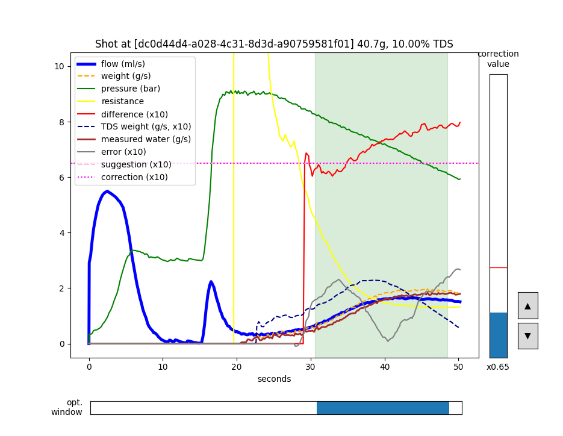
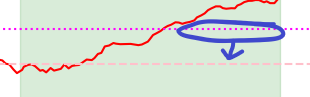

# de1-flow-calibration-estimation

Estimate (quite accurate) flow calibration multiplier for your DE1 espresso machine **without the puck simulator**.
All you need is a shot history **with the weight data from a Bluetooth scale**!
Why pay extra just for the calibration number? 

---

## Available at [](https://mybinder.org/v2/gh/hsyhsw/de1-flow-calibration-estimation/HEAD?urlpath=notebooks%2Fflowcorrection_nb.ipynb%3Fautorun%3Dtrue)

Method 1: upload your shot or designate a URL at [visualizer.coffee](https://visualizer.coffee)
1. Wait until it is fully loaded. (it may take a minute or so.)
1. Scroll down to the bottom, you'll see the program running.
1. Upload .shot file or take a URL from the visualizer.

Method 2: direct import then autorun from visualizer.coffee
- Visit following URL with required params configured
  - Replace ```{shot_id}``` with a shot id at visualizer.coffee **(do not omit opening/closing qoutes)**
  - Replace ```{calib_number}``` with your current calibration multiplier (float number)
  - Use ```verbose=True``` to view verbose graph, ```verbose=False``` otherwise
  - ```URL_ENCODE(...)``` is to be programatically processed after putting all params
```
https://mybinder.org/v2/gh/hsyhsw/de1-flow-calibration-estimation/HEAD?urlpath=URL_ENCODE(notebooks/flowcorrection_nb.ipynb?autorun=true&verbose={True/False}&shot_id='{shot_id}'&current_calibration={calib_number})
```
Complete example:
```
shot_id: b02cc21c-eacc-4e9e-835a-af4d650aa3f4
verbose: True
current_calibration: 0.9

> URL_ENCODE("notebooks/flowcorrection_nb.ipynb?autorun=true&verbose=True&shot_id='b02cc21c-eacc-4e9e-835a-af4d650aa3f4'&current_calibration=0.9")
> notebooks%2Fflowcorrection_nb.ipynb%3Fautorun%3Dtrue%26verbose%3DTrue%26shot_id%3D%27b02cc21c-eacc-4e9e-835a-af4d650aa3f4%27%26current_calibration%3D0.9
https://mybinder.org/v2/gh/hsyhsw/de1-flow-calibration-estimation/HEAD?urlpath=notebooks%2Fflowcorrection_nb.ipynb%3Fautorun%3Dtrue%26verbose%3DTrue%26shot_id%3D%27b02cc21c-eacc-4e9e-835a-af4d650aa3f4%27%26current_calibration%3D0.9
```

## Simple (or maybe too verbose) Guide

Pick a shot that meets following requirements:
- It has the weight data measured from a BT scale
- It came from an actual coffee extraction
  (<span style="font-weight:bold">not from like a calibration basket</span>),
- And it was stable without a massive channeling or so
- It has a pressure declining stage towards the end
  - "Londinium style" profile is usually a good choice (as shown in the screenshot below)
- Or, at least, can be considered a simple and neat "fully saturate, then squeeze" style shot
  - no pause in the middle
  - reasonably good pressure during the extraction  



1. Move optimization window slider (horizontal one) to desired position
    - Typical GOOD region to include: where you think the extraction is stable
      - 3 bars < pressure < 9 bars
      - 1 ml/s < flow < 4 ml/s
    - Typical BAD region to include:
      - coffee just began dropping
      - flow or weight value is spiking
      - pressure is too low (like under 2 bars)
      - flow is too low (like under 1 ml/s)

1. Suggested correction value(<span style="color:pink;font-weight:bold">horizontal pink line</span>)
   also changes as you adjust the optimization window
   
1. Then adjust correction slider (vertical one) to see if <span style="color:blue;font-weight:bold">corrected flow</span>
   well-fits <span style="color:brown;font-weight:bold">measured weight</span> within the window
   - <span style="color:magenta;font-weight:bold">Correction line</span>
    also moves as you adjust the correction value
   - So, first, try to move <span style="color:magenta;font-weight:bold">correction line</span>
     closer to the <span style="color:pink;font-weight:bold">suggestion line</span>

       

1. Use the correction value just found as a starting point finding flow calibration value in the DE1 app.

---

Use python 3.8+ with following packages:
- matplotlib
- scipy
- numpy
- requests

``` 
(venv) de1-flow-calibration-estimation> python -m flowcorrection [-h] [--verbose] [--visualizer [VISUALIZER_URL] | --file [FILE]] [--current-calibration CURRENT_CALIBRATION]
```
- `--verbose, -v`: show verbose graph with a lot of messy stuffs! (if you're nerdy enough)
- `--visualizer [VISUALIZER_URL]`: specify shot URL on the visualizer site (or will be asked)
- `--file [FILE]`: specify a shot file (or will be asked) 
- `--current-calibration CURRENT_CALIBRATION, -c CURRENT_CALIBRATION`: current calibration value from Settings>Machine>Calibrate>Flow (Visualizer mode only)  
- or without any option: you'll be asked to pick a shot file

Sample shots are available in the example directory.
